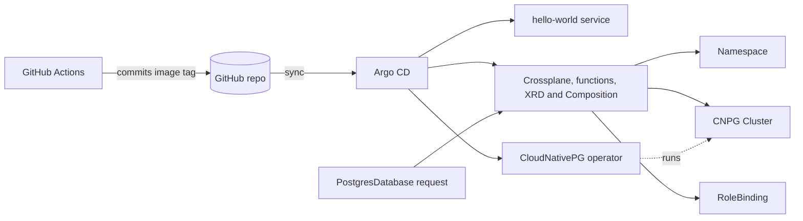

# Self-Service Internal Developer Platform

> I built an internal developer platform that lets a developer go from "I need a new service with a database" to a running, observed, deployed application through a single self-service request — no tickets, no waiting on ops.

That is the target. This README separates what is built and measured today from what is still planned.

---

## Project Status

Built in phases; this table is the honest picture of what exists today.

| Phase | Scope | Status |
|---|---|---|
| 1. Foundation | k3d cluster, Argo CD (app-of-apps), containerized Go service, CI to GHCR, GitOps deploy | **Done** |
| 2. Self-service infrastructure | Crossplane + CloudNativePG: one `PostgresDatabase` request creates a namespace, team RBAC, and a Postgres cluster | **Done** |
| 2.5. Terraform bootstrap | Spin up k3d cluster and ArgoCD using terraform | Next |
| 3. Self-service request | GitHub Actions form: one typed request is validated and committed to `tenants/`; Argo CD and Crossplane do the rest | Planned |
| 4. Guardrails | Kyverno policies, External Secrets + Vault | Planned |
| 5. Observability | Prometheus + Grafana by default for every service | Planned |
| 6. Docs and metrics | Architecture diagram, golden path, before/after numbers | Ongoing |

**Measured so far** (local 3-node k3d cluster):

| Measurement | Result | Notes |
|---|---|---|
| Full rebuild, cluster deleted to everything Synced/Healthy | ~2 m 30 s | One script, zero manual steps. Was 1 m 22 s at the end of Phase 1, before Crossplane and CloudNativePG were added |
| Database request to Ready, warm cluster | **~47 s** | 2 instances, `small`. Earlier runs: 43 s, 46 s, 52 s |
| Database request to Ready, first request on a fresh cluster | ~1 m 45 s | Image pulls are the likely cause; not confirmed |
| `git push` to new image running | ~1 m 45 s | One sample. Argo CD polls Git about every 3 minutes; no webhook on local k3d |
| CI duration | ~65-67 s | Three runs; upper bound from git timestamps |

The headline metric, developer request to deployed service, is measured in Phase 3.

Per-phase notes, including the problems hit and how they were solved: [Phase 1](docs/progress-notes/phase-1.md), [Phase 2](docs/progress-notes/phase-2.md).

## The Problem

At most organizations, getting a new service into production means filing a ticket, waiting on a platform/ops team to provision infrastructure by hand, and looping through review cycles that can take days. This project asks: what if a developer could request "a new service with a database" the same way they request a pull request review — and get it in minutes, with security and observability built in by default instead of bolted on afterward?

## What This Platform Does

**Target experience (the form in step 1 arrives in Phase 3; steps 5 and 6 in Phases 4 and 5).** A developer fills out one form (a GitHub Actions workflow with typed inputs). That single action:

1. Validates the request before it lands
2. Commits the request to `tenants/`, with no ticket and no human approval step
3. Provisions the backing infrastructure through Crossplane (namespace, database, RBAC)
4. Deploys the service via GitOps — no manual `kubectl apply`, ever
5. Applies security and compliance guardrails automatically (no root containers, required labels, no plaintext secrets)
6. Surfaces observability (metrics, dashboards) with zero extra setup

**Working today:** the CI/GitOps delivery loop (step 4, for the sample app) and the infrastructure request (step 3). A developer submits one small manifest and gets a database:

```yaml
apiVersion: rcarlsondevops.org/v1alpha1
kind: PostgresDatabase
metadata:
  name: example-postgresdatabase
spec:
  team: example-team
  instances: 2      # 1 to 3, required
  size: small       # small | medium | large = 1Gi / 2Gi / 3Gi per instance
```

Crossplane turns that into a Namespace (`<name>-db`), a CloudNativePG `Cluster` named `postgres-db` inside it, and a RoleBinding that gives the `spec.team` group the built-in `edit` role in that namespace only. The full request reference, including every field, error message, and generated Secret and Service name, is in [`docs/database-request-format.md`](docs/database-request-format.md).

## Architecture

What is built so far. The self-service form, Kyverno, External Secrets, and Prometheus are not drawn because they do not exist yet. Today a database request is applied with `kubectl`; in Phase 3 the form commits it to Git instead.



## Stack

| Layer | Tool | Status | Why |
|---|---|---|---|
| Cluster | k3d (k3s v1.35.5), 1 server + 2 agents | In use | Reproducible, runs locally, no cloud cost to evaluate |
| GitOps delivery | Argo CD v3.5.3, app-of-apps | In use | Git as the single source of truth; no manual deploys |
| Infrastructure provisioning | Crossplane v2 (chart 2.4.2), pipeline-mode Composition | In use | Kubernetes-native IaC — infra requests are just another API call to the cluster |
| Crossplane functions | function-go-templating v0.13.0, function-auto-ready v0.7.0, function-sequencer v0.6.0 | In use | Template the resources, report readiness, order creation |
| Database | CloudNativePG (chart 0.29.1) | In use | Kubernetes-native Postgres operator; no cloud provider needed locally |
| CI | GitHub Actions, images in GHCR | In use | Standard, free, widely recognized |
| Self-service front door | GitHub Actions (`workflow_dispatch` form) | Phase 3 | One typed form as the single entry point; no extra tooling to host |
| Policy as code | Kyverno | Phase 4 | Guardrails enforced automatically, not reviewed manually |
| Secrets | External Secrets Operator + Vault (dev) or SOPS | Phase 4 | No plaintext secrets ever committed to Git |
| Observability | Prometheus + Grafana | Phase 5 | Metrics available by default for anything deployed through the platform |

## Design Decisions Worth Knowing

- **Small, validated API.** Three inputs. Limits live in the schema, so bad requests (`instances: 500`, a team name with a space, a missing `team`) are rejected at admission with a clear message. Seven such cases were tested against the live API server.
- **The XRD is the contract, the Composition is the implementation.** `size` maps to storage inside the Composition, so the mapping can change without breaking developers.
- **No Crossplane provider.** The Composition emits Kubernetes objects directly, so nothing cloud-specific is needed locally.
- **Namespace per database, fixed Cluster name.** Secret and Service names (`postgres-db-app`, `postgres-db-rw`, `-ro`, `-r`) are predictable, so templates and docs can rely on them.
- **Least privilege for Crossplane.** It may hand out only the `edit` role (the `bind` verb restricted with `resourceNames`), not any role in the cluster. The first version was too wide; I found that by testing the negative case with `kubectl auth can-i`, fixed it, and re-verified.
- **Team access by group, not user.** Membership changes in the identity provider, not in the Composition.
- **Git records what is deployed.** CI pushes an immutable `sha-<short>` image tag and commits it to `environments/dev/values-dev.yaml`; CI never touches the cluster.

## The Golden Path: New Service in Under 10 Minutes

_Target flow, filled in for real once Phase 3 is done. Until then, the working piece is the database request above._

1. Open the repo's **Actions** tab, select the self-service workflow, and click **Run workflow**
2. Fill in service name, team/owner, and whether it needs a database
3. Submit — the workflow validates the request and commits it to `tenants/`
4. Argo CD syncs the new commit and Crossplane provisions the infrastructure
5. Watch the rollout in Argo CD
6. Your service is live, with metrics already visible in Grafana

## What's Next at Scale

- **Multi-tenancy:** namespace-per-team isolation with resource quotas, rather than a shared flat cluster
- **Cost tracking:** tag-based cost attribution surfaced back to teams (for example in Grafana) so they see what their infra costs
- **More service types:** expand beyond one service type to cover common patterns (worker/queue consumer, scheduled job, static site)
- **Self-service beyond day 1:** scaling, rollback, and decommissioning through the same self-service workflow, not just creation
- **Database hardening:** backups, a resize path, conditional synchronous replication, read-only and admin role options, and CPU/memory in `size`
- **Narrower Crossplane permissions:** its Namespace rule currently allows all verbs, which is fine locally but too broad for a shared cluster

## Repository Layout

```
.
├── app/                     Go hello-world service (see app/README.md)
├── argocd/
│   ├── root.yaml            App-of-apps root; the only Argo resource applied by hand
│   └── apps/                Argo CD Application manifests only
│       ├── 00-operators/        CloudNativePG, Crossplane
│       ├── 10-crossplane-runtime/   Crossplane functions
│       ├── 20-platform-api/     PostgresDatabase API
│       └── 30-workloads/        hello-world-dev
├── bootstrap/               bootstrap.sh, k3d config, pinned Argo CD install
├── charts/hello-world/      Helm chart for the sample app
├── crossplane/
│   ├── functions/           The three Crossplane Function packages
│   ├── api/                 Crossplane RBAC; database/ holds the XRD and Composition
│   └── examples/            Example request (not synced by Argo CD)
├── environments/dev/        values-dev.yaml, image tag written by CI
├── docs/                    Request format doc and per-phase progress notes
└── .github/workflows/       CI
```

Folders for later phases (`policies/`, `secrets/`, `observability/`, `tenants/`) are added as those phases start. Ordering between components comes from sync-wave annotations on the Applications, not from folder name prefixes.

## Running This Locally

Everything outside the bootstrap script is deployed by Argo CD from this repo.

**Prerequisites:** Docker, [k3d](https://k3d.io) v5.x, and `kubectl`.

**1. Clone the repo**

```bash
git clone https://github.com/rcarlson-devops/self-service-idp.git
cd self-service-idp
```

**2. Run the bootstrap**

```bash
./bootstrap/bootstrap.sh
```

This creates the k3d cluster (`bootstrap/k3d-config.yaml`), installs a pinned version of Argo CD (`bootstrap/argocd/`), and applies `argocd/root.yaml`. From that point Argo CD pulls everything else from Git: the operators, the Crossplane functions, the database API, and the sample app. Expect about 2.5 minutes on a warm machine. It is safe to re-run.

The sample app's image package on GHCR is public, so no registry credentials are needed. (`bootstrap.sh` still contains an optional pull-secret step for a private package; it is skipped when `GHCR_USER` and `GHCR_TOKEN` are unset.)

**3. Open Argo CD**

The UI is at <https://localhost:8080> (self-signed certificate). Log in as `admin` with the generated password:

```bash
kubectl -n argocd get secret argocd-initial-admin-secret \
  -o jsonpath='{.data.password}' | base64 -d; echo
```

**4. Check that everything synced**

```bash
kubectl -n argocd get applications     # all should end up Synced / Healthy
kubectl -n hello-world-dev get pods
kubectl -n hello-world-dev port-forward svc/hello-world 9090:80
curl localhost:9090/version
```

**5. Request a database**

Once the Applications are Synced and Crossplane is ready:

```bash
kubectl apply -f crossplane/examples/first-example.yaml
kubectl get postgresdatabase           # READY=True after about a minute
kubectl get cluster,pods -n example-postgresdatabase-db
```

Deleting the request (`kubectl delete -f crossplane/examples/first-example.yaml`) removes the namespace and the database with its data.

**Tear down**

```bash
k3d cluster delete dev-cluster
```

### How a code change reaches the cluster

1. Push a change under `app/` to `main`.
2. GitHub Actions vets, tests, builds the image, and pushes it to GHCR tagged `sha-<short-sha>`.
3. The workflow commits that tag to `environments/dev/values-dev.yaml`.
4. Argo CD detects the new commit and rolls out the new image. No `kubectl apply` anywhere.

## Known Limitations

- The Go app has no `/metrics` endpoint yet, which Phase 5 needs.
- The Helm chart's resource names ignore the release name, so two services from one chart in one namespace would collide. This is fixed before the Phase 3 self-service workflow generates services.
- The CI bot commits directly to `main`, which would not work with branch protection.
- Database volumes cannot be resized (the local storage class disallows expansion), and deleting a request deletes its data.
- No guardrails or secrets management yet; those are Phase 4. Database credentials live in the generated Kubernetes Secret.
- Timings are from one local machine, several are single samples, and the cold-start explanation was not verified.

## About This Project

Built by [Robert Carlson](https://www.linkedin.com/in/robertjohncarlson) as a hands-on demonstration of platform engineering practices — self-service infrastructure, GitOps, policy-as-code, and observability by default — following 10+ years in DevOps and cloud engineering across AWS, Azure, and Kubernetes environments.
