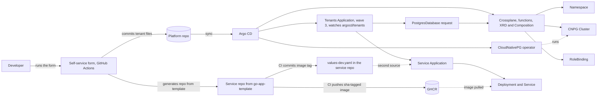

# Self-Service Internal Developer Platform

> I built an internal developer platform that lets a developer go from "I need a new service with a database" to a running, observed, deployed application through a single self-service request — no tickets, no waiting on ops.

That is the target. This README separates what is built and measured today from what is still planned. One gap matters most: the platform provisions the database and reports it Ready, and the service code can connect to it (proven once with a Secret copied by hand), but credentials are not delivered automatically yet. Vault and External Secrets are installed for that job and are not wired in (Phase 4).

---

## Project Status

Built in phases; this table is the honest picture of what exists today.

| Phase | Scope | Status |
|---|---|---|
| 1. Foundation | k3d cluster, Argo CD (app-of-apps), containerized Go service, CI to GHCR, GitOps deploy | **Done** |
| 2. Self-service infrastructure | Crossplane + CloudNativePG: one `PostgresDatabase` request creates a namespace, team RBAC, and a Postgres cluster | **Done** |
| 3. Self-service request | GitHub Actions form: one typed request creates the service's own repo from a template and commits its Argo CD Application and database request to `argocd/tenants/`; Argo CD and Crossplane do the rest | **Working end to end** (three runs, each ending in a running service and a Ready database); hardening of the form (failure handling, a timing summary) is in progress; input checks and preflight are done |
| 4. Guardrails | The service's database connection (External Secrets + Vault), image scanning and signing, Kyverno policies, default-deny network policies and quotas | **In progress.** Vault (standalone mode) and External Secrets are installed; configuring Vault and wiring credentials to services is next. The rest is planned |
| 5. Observability | Container-level metrics and a per-service dashboard by default (Prometheus + Grafana) | Planned |
| 6. Docs and metrics | Architecture diagram, golden path, before/after numbers | Ongoing |

**Measured so far** (local 3-node k3d cluster):

| Measurement | Result | Notes |
|---|---|---|
| Full rebuild, cluster created to every Application Healthy | **~5 m 08 s** | Read from timestamps on 2026-10-07, from the k3d node container being created to the last Application becoming Healthy. Everything except the CloudNativePG operator was Healthy after 2 m 07 s. The operator was Synced after 13 s but did not become Healthy until 3 m 14 s after that, and I have not found the cause. A rebuild on 2026-10-05 also took about 5 minutes, by eye. Earlier figures were 1 m 22 s at the end of Phase 1 (before Crossplane and CloudNativePG existed) and about 2 m 30 s at the end of Phase 2; neither had a defined stopping point, so they are not comparable |
| Database request to Ready, warm cluster | **~47 s** | 2 instances, `small`. Earlier runs: 43 s, 46 s, 52 s. A request committed to `argocd/tenants/` took 50 s from creation to Ready (read from timestamps) |
| Database request to Ready, first request on a fresh cluster | ~1 m 45 s | Image pulls are the likely cause; not confirmed |
| `git push` to new image running | ~1 m 45 s | One sample. Argo CD polls Git on an interval (see the detection delay below); no webhook on local k3d |
| Argo CD sync to service Ready (hand-built tenant) | ~71 s | One forced sync; approximate, read from the Deployment's age rather than timestamps. Includes the image pull |
| `git push` of a database request to Ready | 6 m 21 s | One sample, timed by clock. Includes Argo CD's polling wait, so it is not a platform time. It is longer than a poll plus the 50 s provisioning would suggest, and I have not yet worked out where the rest went |
| CI duration | 62-118 s | Generated service repos; the spread has not been investigated |
| Form submit to tenant commit, warm | 82 s and 133 s | Two samples. Includes validation, repo creation, the new repo's first CI run, and the form waiting for its image tag |
| Argo CD detection delay (commit to the Application appearing) | 189 s and 261 s | Two samples. Argo CD's default polling interval is 3 minutes and nothing in this cluster changes it, so both samples exceeded it. I have not explained the excess; Argo's reconcile jitter is a candidate I have not confirmed |
| Service platform time, warm | 7 s | Application creation to the pod being Ready |
| Database request to Ready, measured on the form runs | 22-24 s warm, 67 s cold | Cold-start cause not confirmed. These runs used a different stopping point from the earlier database rows above, and I have not reconciled the two sets |
| **Form submit to service Ready** | **278 s and 401 s** | Two samples. The largest part is Argo CD's polling wait, so it is reported separately from platform time |

The headline metric, developer request to deployed service, is now measured: 278 s and 401 s from submitting the form to a Ready service (two runs, local cluster). I report Argo CD's polling wait separately from platform time, because where a commit lands in the poll cycle changes it.

Per-phase notes, including the problems hit and how they were solved: [Phase 1](docs/progress-notes/phase-1.md), [Phase 2](docs/progress-notes/phase-2.md), [Phase 3](docs/progress-notes/phase-3.md).

## The Problem

At most organizations, getting a new service into production means filing a ticket, waiting on a platform/ops team to provision infrastructure by hand, and looping through review cycles that can take days. This project asks: what if a developer could request "a new service with a database" the same way they request a pull request review — and get it in minutes, with security and observability built in by default instead of bolted on afterward?

## What This Platform Does

**Target experience (steps 1 to 5 work today; step 6 arrives in Phase 4, step 7 in Phase 5).** A developer fills out one form (a GitHub Actions workflow with typed inputs). That single action:

1. Validates the request before it lands
2. Creates the service's own repository from a template; that repository's CI builds and pushes the first image
3. Commits the service's Argo CD Application and its database request to `argocd/tenants/`, with no ticket and no human approval step
4. Provisions the backing infrastructure through Crossplane (namespace, database, RBAC)
5. Deploys the service via GitOps — no manual `kubectl apply`, ever
6. Applies security and compliance guardrails automatically (no root containers, required labels, no plaintext secrets)
7. Surfaces observability (metrics, dashboards) with zero extra setup

**Working today:** steps 1 to 5. The form validates the request, creates the service's repository from `go-app-template` through the GitHub REST API (with a fine-grained token), waits for that repository's CI to publish the first image, and commits the Application and the database request to `argocd/tenants/`. Argo CD then deploys the service from the shared chart plus the service repo's values file, and Crossplane builds the database, with no `kubectl apply`. This has run end to end three times. **Not working yet:** credentials do not reach the service automatically. The service code connects to its database when it is given the credentials as a Secret (proven once with a Secret copied by hand: its `/db` endpoint reported connected). Vault and External Secrets are installed to deliver that Secret, but they are not wired to any service yet (Phase 4). Behind the form, the database request is one small manifest:

```yaml
apiVersion: rcarlsondevops.org/v1alpha1
kind: PostgresDatabase
metadata:
  name: example-postgresdatabase
spec:
  team: example-team
  instances: 2      # 1 to 3, required
  size: small       # small | medium | large = 1Gi / 2Gi / 3Gi per instance
```

Crossplane turns that into a Namespace (`<name>-db`), a CloudNativePG `Cluster` named `postgres-db` inside it, and a RoleBinding that gives the `spec.team` group the built-in `edit` role in that namespace only. The full request reference, including every field, error message, and generated Secret and Service name, is in [`docs/database-request-format.md`](docs/database-request-format.md).

## Architecture

What is built so far. Kyverno and Prometheus are not drawn because they do not exist yet. Vault and External Secrets are installed but not drawn, because nothing is connected to them yet. The form generates the files in `argocd/tenants/`; they can also still be placed by hand.



## Stack

| Layer | Tool | Status | Why |
|---|---|---|---|
| Cluster | k3d (k3s v1.35.5), 1 server + 2 agents | In use | Reproducible, runs locally, no cloud cost to evaluate |
| GitOps delivery | Argo CD v3.5.3, app-of-apps | In use | Git as the single source of truth; no manual deploys |
| Infrastructure provisioning | Crossplane v2 (chart 2.4.2), pipeline-mode Composition | In use | Kubernetes-native IaC — infra requests are just another API call to the cluster |
| Crossplane functions | function-go-templating v0.13.0, function-auto-ready v0.7.0, function-sequencer v0.6.0 | In use | Template the resources, report readiness, order creation |
| Database | CloudNativePG (chart 0.29.1) | In use | Kubernetes-native Postgres operator; no cloud provider needed locally |
| Service template | GitHub template repository `go-app-template` | In use | The golden path for a service lives in its own repo, so it can be tested and versioned separately from the platform |
| CI | GitHub Actions in each service repo, images in GHCR | In use | Standard, free, widely recognized |
| Tenant discovery | One recursive Argo CD Application (sync wave 3) on `argocd/tenants/` | In use | One folder per service; picks up generated Applications and database requests, after the database API is installed |
| Self-service front door | GitHub Actions (`workflow_dispatch` form) | In use | One typed form as the single entry point; no extra tooling to host |
| Policy as code | Kyverno | Phase 4 | Guardrails enforced automatically, not reviewed manually |
| Secrets | External Secrets Operator + HashiCorp Vault (standalone mode) | Installed; wiring in Phase 4 | No plaintext secrets ever committed to Git; Git holds only references. Standalone rather than dev mode on purpose: I wanted it as close to a production deployment as a local cluster allows, so it has to be initialized and unsealed by hand |
| Observability | Prometheus + Grafana | Phase 5 | Metrics available by default for anything deployed through the platform |

## Design Decisions Worth Knowing

- **Small, validated API.** Three inputs. Limits live in the schema, so bad requests (`instances: 500`, a team name with a space, a missing `team`) are rejected at admission with a clear message. Seven such cases were tested against the live API server.
- **The XRD is the contract, the Composition is the implementation.** `size` maps to storage inside the Composition, so the mapping can change without breaking developers.
- **No Crossplane provider.** The Composition emits Kubernetes objects directly, so nothing cloud-specific is needed locally.
- **Namespace per database, fixed Cluster name.** Secret and Service names (`postgres-db-app`, `postgres-db-rw`, `-ro`, `-r`) are predictable, so templates and docs can rely on them.
- **Least privilege for Crossplane.** It may hand out only the `edit` role (the `bind` verb restricted with `resourceNames`), not any role in the cluster. The first version was too wide; I found that by testing the negative case with `kubectl auth can-i`, fixed it, and re-verified.
- **Team access by group, not user.** Membership changes in the identity provider, not in the Composition.
- **Git records what is deployed.** Each service's CI pushes an immutable `sha-<short>` image tag and commits it to its own `environments/dev/values-dev.yaml`; CI never touches the cluster. By design, the platform repo holds only the Application that points at the service repo, so a new image never needs a commit to the platform repo. I confirmed this on the cluster with a hand-built service: the Deployment's image came from the service repo's values file.
- **One repository per service.** The platform repo is the control plane (shared chart, Argo CD configuration, Crossplane API, generated Applications); service source lives in repos generated from the template. If a service team would own and change a file, it belongs in the template; if the platform owns it, it stays here.
- **One Application per service, two sources.** The generated Application combines the shared chart from this repo with the service repo's values file. The Application name, Helm release name, service name and namespace are the same string, so object names and selectors line up.
- **One folder per service, watched by one recursive Application.** `argocd/tenants/<service>/` holds the service's Application and, optionally, a `PostgresDatabase` request. The watching Application runs at sync wave 3 so the database API exists before any request is applied. A request committed there reached Ready while that Application stayed Healthy.
- **Blueprints are valid YAML with blank values, not placeholders.** The form fills them with `yq` by path and fails the run if any blank is left; plain `envsubst` would also blank Argo CD's `$values` reference. The fill and the check were tested on a copy first, and the form has since run end to end.
- **Every service gets a database.** The form no longer asks whether one is needed; the database request is the heart of what the platform provides.
- **The form waits for the first image tag with its own polling loop.** It watches the tag in the new repo's values file, which is the thing the next step needs, instead of waiting on a generic CI-finished signal.
- **Vault runs in standalone mode, deliberately.** Dev mode starts initialized and unsealed with a known root token, which hides the parts of running Vault that matter. Standalone mode needs a one-time `vault operator init` and three `vault operator unseal` runs (steps in [`docs/setup.md`](docs/setup.md)), which is the cost of the more realistic setup. I drew the line at what a single-node local cluster can do honestly. The plan is for External Secrets to authenticate with Vault's Kubernetes auth and a least-privilege policy with per-service paths, not the root token; that is not configured yet. Features that only make sense in production (auto-unseal from a cloud KMS, a multi-replica Raft cluster, TLS to Vault) are listed under limitations instead of being faked.

## The Golden Path: New Service in Under 10 Minutes

_Measured on a local cluster: 278 s and 401 s from submitting the form to a Ready service (two runs). Two parts are not there yet: the Grafana metrics in step 6 arrive in Phase 5, and credentials do not reach the service automatically until Phase 4._

1. Open the platform repo's **Actions** tab, select the self-service workflow, and click **Run workflow**
2. Fill in the service and team name, the number of database instances, and the database size
3. Submit — the workflow validates the request, creates the service's repo from the template, waits for its first image, and commits the service's Application to `argocd/tenants/`
4. Argo CD syncs the new commit and Crossplane provisions the infrastructure
5. Watch the rollout in Argo CD
6. Your service is live (metrics in Grafana arrive in Phase 5)

## What's Next at Scale

- **Multi-tenancy:** namespace-per-team isolation with resource quotas, rather than a shared flat cluster
- **Cost tracking:** tag-based cost attribution surfaced back to teams (for example in Grafana) so they see what their infra costs
- **More service types:** expand beyond one service type to cover common patterns (worker/queue consumer, scheduled job, static site)
- **Self-service beyond day 1:** scaling, rollback, and decommissioning through the same self-service workflow, not just creation
- **Database hardening:** backups, a resize path, conditional synchronous replication, read-only and admin role options, and CPU/memory in `size`
- **Narrower Crossplane permissions:** its Namespace rule currently allows all verbs, which is fine locally but too broad for a shared cluster
- **The foundation layer as Terraform:** `bootstrap.sh` is a script because the cluster is a disposable local k3d cluster and k3d has no officially maintained Terraform support. For real clusters, networking, and identity, Terraform is where I would put that slow-changing layer, run by a human with reviewed plans and remote state, leaving Crossplane for per-request resources and Argo CD for everything in Git
- **Faster change detection:** Argo CD polls Git on an interval (the default interval is 3 minutes; the measured delay was 189 s and 261 s), and a local k3d cluster is not reachable by a GitHub webhook. A webhook (or a refresh trigger) would remove that wait on a real cluster
- **A GitHub App instead of a personal token:** the self-service form creates repositories with a fine-grained personal access token tied to one person. A GitHub App with narrow, short-lived installation tokens is the scalable replacement
- **TLS and tracing:** this version has no certificate management (cert-manager) and no distributed tracing
- **A production-grade Vault:** auto-unseal from a cloud KMS so a restart needs no human, a multi-replica Raft cluster, TLS between External Secrets and Vault, and unseal key shares split between several people. The local setup has one replica, plain HTTP inside the cluster, and unseal keys held by one person

## Repository Layout

```
.
├── .github/workflows/       The self-service form
├── argocd/
│   ├── root.yaml            App-of-apps root; the only Argo resource applied by hand
│   ├── apps/                Argo CD Application manifests only
│   │   ├── 00-operators/        CloudNativePG, Crossplane
│   │   ├── 10-crossplane-runtime/   Crossplane functions
│   │   ├── 20-platform-api/     PostgresDatabase API
│   │   └── 30-workloads/        The Application that watches argocd/tenants/
│   └── tenants/             One folder per service: its Application and its database request
├── bootstrap/               bootstrap.sh, k3d config, pinned Argo CD install
├── charts/app/              Shared Helm chart used by every service
├── crossplane/
│   ├── functions/           The three Crossplane Function packages
│   └── api/                 Crossplane RBAC; database/ holds the XRD and Composition
├── self-service/
│   └── templates/           Application and database blueprints the form fills in (not synced by Argo CD)
└── docs/                    Request format doc, one-time setup, and per-phase progress notes
```

Service source code does not live in this repo. Each service is generated into its own repository from the `go-app-template` template repo. Folders for later work (`policies/`, `secrets/`, `observability/`) are added as those phases start. Ordering between components comes from sync-wave annotations on the Applications, not from folder name prefixes.

## Running This Locally

Everything outside the bootstrap script is deployed by Argo CD from this repo.

**Prerequisites:** Docker, [k3d](https://k3d.io) v5.x, and `kubectl`. The self-service form also needs a one-time GitHub setup (template repo, access token, Actions secret); see [`docs/setup.md`](docs/setup.md).

**1. Clone the repo**

```bash
git clone https://github.com/rcarlson-devops/self-service-idp.git
cd self-service-idp
```

**2. Run the bootstrap**

```bash
./bootstrap/bootstrap.sh
```

This creates the k3d cluster (`bootstrap/k3d-config.yaml`), installs a pinned version of Argo CD (`bootstrap/argocd/`), and applies `argocd/root.yaml`. From that point Argo CD pulls everything else from Git: the operators, the Crossplane functions, the database API, and the Application that watches `argocd/tenants/`. Expect about 5 minutes until every Application is Healthy; most of it is the CloudNativePG operator (see the measurements above). The 5 minutes was measured before Vault was added and does not include the manual Vault steps in step 4. It is safe to re-run.

**3. Open Argo CD**

The UI is at <https://localhost:8080> (self-signed certificate). Log in as `admin` with the generated password:

```bash
kubectl -n argocd get secret argocd-initial-admin-secret \
  -o jsonpath='{.data.password}' | base64 -d; echo
```

**4. Check that everything synced**

```bash
kubectl -n argocd get applications     # all should end up Synced / Healthy (Vault once unsealed)
```

Vault will not report Healthy until it is initialized and unsealed by hand: once per cluster build, and the unseal again after any Vault pod restart. The commands are in [`docs/setup.md`](docs/setup.md), step 5. Keep the unseal keys and root token it prints in a password manager, never in Git.

**5. Request a service and its database**

Run the self-service form (see the golden path below). It creates the service's repository and commits the service's Application and its `PostgresDatabase` request to `argocd/tenants/<service>/`; Argo CD applies them on its next poll. Committing finished manifests there by hand also works. Then check:

```bash
kubectl get postgresdatabase           # READY=True after about a minute
kubectl get cluster,pods -n <service>-db
```

Removing a service's folder from `argocd/tenants/` removes the service, its database and the data.

**Tear down**

```bash
k3d cluster delete dev-cluster
```

### How a service's code change is built

Each service repo, generated from `go-app-template`, carries its own CI:

1. Push a change under `app/` to `main`.
2. GitHub Actions vets, tests, builds the image, and pushes it to GHCR tagged `sha-<short-sha>`.
3. The workflow commits the image repository and tag to the service repo's `environments/dev/values-dev.yaml`.

Rolling that image out is done by an Application in `argocd/tenants/` that combines the shared chart from this repo with that values file. The form generates that Application.

## Known Limitations

- The service template exposes no application-level metrics; Phase 5 covers container-level metrics only.
- Generated service repositories are public in this version, and so are their images.
- The self-service form creates repositories with a fine-grained personal access token, which is broader than I would accept at scale.
- Argo CD polls Git every 3 minutes by default, and I measured 189 s and 261 s before it noticed a new tenant commit. This is the largest part of the form-to-service time. The interval is configurable and I left it at the default. A webhook cannot reach a local k3d cluster.
- Credentials are not delivered to the service automatically. The service's code can connect (proven once, with a Secret copied by hand), but the credentials live in a Secret in the database's own namespace and nothing syncs them into the service's namespace yet. Vault and External Secrets are installed for that and are not wired in (Phase 4).
- The single `team` input is the service name, repository name, namespace and access group, so anyone who can run the form can grant any group the `edit` role in that namespace. That is harmless on a local cluster; splitting the input is planned for Phase 4.
- Removing a service is a Git change, and Argo CD prunes automatically: deleting a service's folder deletes the service and, if it has one, its database and data. In one test, deleting a folder left the tenants Application OutOfSync until I deleted the Applications by hand; I have not found the cause, and the cluster where I saw it has since been deleted.
- Failure handling is not built: if a form run stops half-way, the repository it created stays, and running the form again with the same name fails until that repository is removed by hand. Input checks run before anything is created: name rules, reserved names (including any name ending in `-db`), an existing repository of the same name, and an existing tenant folder of the same name. Two runs started at the same moment can still both pass these checks. A run that times out while waiting for the image tag (the step limit is 5 minutes) is cancelled with GitHub's generic timeout message, not a specific one.
- The CI bot commits directly to `main` in each service repo, which would not work with branch protection.
- Database volumes cannot be resized (the local storage class disallows expansion), and deleting a request deletes its data.
- No guardrails yet, and secrets management is half built: Vault and External Secrets are installed but hold and sync nothing for services (Phase 4). Database credentials still live in the generated Kubernetes Secret.
- Vault is a local approximation of a production deployment. It runs in standalone mode as a single replica, so it has no fault tolerance; it uses plain HTTP inside the cluster; and it is unsealed by hand, because auto-unseal needs a cloud KMS that a local free-tier setup does not have. The unseal keys and root token are held by one person in a password manager. A cluster rebuild means a new init and new keys, and Vault's contents are lost. A Vault pod restart leaves it sealed until someone unseals it. Once services depend on it, a sealed Vault would stop new services from receiving credentials; I have not tested how Secrets that were already synced behave.
- Timings are from one local machine, several are single samples, the cold-start explanation was not verified, and the slow start-up of the CloudNativePG operator (seen in two rebuilds) is unexplained.

## About This Project

Built by [Robert Carlson](https://www.linkedin.com/in/robertjohncarlson) as a hands-on demonstration of platform engineering practices — self-service infrastructure, GitOps, policy-as-code, and observability by default — following 10+ years in DevOps and cloud engineering across AWS, Azure, and Kubernetes environments.
