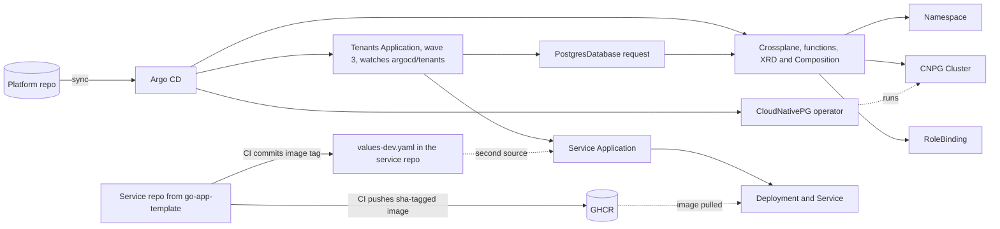

# Self-Service Internal Developer Platform

> I built an internal developer platform that lets a developer go from "I need a new service with a database" to a running, observed, deployed application through a single self-service request — no tickets, no waiting on ops.

That is the target. This README separates what is built and measured today from what is still planned.

---

## Project Status

Built in phases; this table is the honest picture of what exists today.

| Phase | Scope | Status |
|---|---|---|
| 1. Foundation | k3d cluster, Argo CD (app-of-apps), containerized Go service, CI to GHCR, GitOps deploy | **Done** |
| 2. Self-service infrastructure | Crossplane + CloudNativePG: one `PostgresDatabase` request creates a namespace, team RBAC, and a Postgres cluster | **Done** |
| 3. Self-service request | GitHub Actions form: one typed request creates the service's own repo from a template and commits its Argo CD Application (and an optional database request) to `argocd/tenants/`; Argo CD and Crossplane do the rest | **In progress** (template repo, shared chart and `argocd/tenants/` work; a hand-built service plus database deployed end to end; repo creation through the GitHub REST API works; the form is drafted but has not been run end to end) |
| 4. Guardrails | Kyverno policies, External Secrets + Vault | Planned |
| 5. Observability | Prometheus + Grafana by default for every service | Planned |
| 6. Docs and metrics | Architecture diagram, golden path, before/after numbers | Ongoing |

**Measured so far** (local 3-node k3d cluster):

| Measurement | Result | Notes |
|---|---|---|
| Full rebuild, cluster deleted to everything Synced/Healthy | ~2 m 30 s | One script, zero manual steps. Was 1 m 22 s at the end of Phase 1, before Crossplane and CloudNativePG were added. A later rebuild took about 5 minutes by eye, with the CloudNativePG operator slow to become Healthy. I had not defined the stopping point or scripted the clock, so the two numbers are not comparable, and I have not found the cause |
| Database request to Ready, warm cluster | **~47 s** | 2 instances, `small`. Earlier runs: 43 s, 46 s, 52 s. A request committed to `argocd/tenants/` took 50 s from creation to Ready (read from timestamps) |
| Database request to Ready, first request on a fresh cluster | ~1 m 45 s | Image pulls are the likely cause; not confirmed |
| `git push` to new image running | ~1 m 45 s | One sample. Argo CD polls Git about every 3 minutes; no webhook on local k3d |
| Argo CD sync to service Ready (hand-built tenant) | ~71 s | One forced sync; approximate, read from the Deployment's age rather than timestamps. Includes the image pull |
| `git push` of a database request to Ready | 6 m 21 s | One sample, timed by clock. Includes Argo CD's polling wait, so it is not a platform time. It is longer than a poll plus the 50 s provisioning would suggest, and I have not yet worked out where the rest went |
| CI duration | ~65-67 s | Three runs; upper bound from git timestamps |

The headline metric, developer request to deployed service, is measured once the form runs end to end. I report Argo CD's polling wait separately from platform time, because where a push lands in the poll cycle changes it.

Per-phase notes, including the problems hit and how they were solved: [Phase 1](docs/progress-notes/phase-1.md), [Phase 2](docs/progress-notes/phase-2.md).

## The Problem

At most organizations, getting a new service into production means filing a ticket, waiting on a platform/ops team to provision infrastructure by hand, and looping through review cycles that can take days. This project asks: what if a developer could request "a new service with a database" the same way they request a pull request review — and get it in minutes, with security and observability built in by default instead of bolted on afterward?

## What This Platform Does

**Target experience (steps 1 to 3 arrive in Phase 3, step 6 in Phase 4, step 7 in Phase 5).** A developer fills out one form (a GitHub Actions workflow with typed inputs). That single action:

1. Validates the request before it lands
2. Creates the service's own repository from a template; that repository's CI builds and pushes the first image
3. Commits the service's Argo CD Application (and a database request, if asked for) to `argocd/tenants/`, with no ticket and no human approval step
4. Provisions the backing infrastructure through Crossplane (namespace, database, RBAC)
5. Deploys the service via GitOps — no manual `kubectl apply`, ever
6. Applies security and compliance guardrails automatically (no root containers, required labels, no plaintext secrets)
7. Surfaces observability (metrics, dashboards) with zero extra setup

**Working today:** steps 4 and 5, and the commit in step 3 when the files are placed by hand. A service built from `go-app-template`, plus a `PostgresDatabase` request, committed under `argocd/tenants/`, were picked up by Argo CD with no `kubectl apply`: the service deployed from the shared chart plus the service repo's values file, and the database came up. Creating a repository from the template through the GitHub REST API works with a fine-grained token. The form that chains validation, repo creation, waiting for the first image and the commit is drafted but has not yet been run end to end. A developer submits one small manifest and gets a database:

```yaml
apiVersion: rcarlsondevops.org/v1alpha1
kind: PostgresDatabase
metadata:
  name: example-postgresdatabase
spec:
  team: example-team
  instances: 2      # 1 to 3, required
  size: small       # small | medium | large = 1Gi / 2Gi / 3Gi per instance
```

Crossplane turns that into a Namespace (`<name>-db`), a CloudNativePG `Cluster` named `postgres-db` inside it, and a RoleBinding that gives the `spec.team` group the built-in `edit` role in that namespace only. The full request reference, including every field, error message, and generated Secret and Service name, is in [`docs/database-request-format.md`](docs/database-request-format.md).

## Architecture

What is built so far. The self-service form is not drawn because it has not run end to end, and Kyverno, External Secrets, and Prometheus are not drawn because they do not exist yet. Today the files in `argocd/tenants/` are placed by hand; the form will generate them.



## Stack

| Layer | Tool | Status | Why |
|---|---|---|---|
| Cluster | k3d (k3s v1.35.5), 1 server + 2 agents | In use | Reproducible, runs locally, no cloud cost to evaluate |
| GitOps delivery | Argo CD v3.5.3, app-of-apps | In use | Git as the single source of truth; no manual deploys |
| Infrastructure provisioning | Crossplane v2 (chart 2.4.2), pipeline-mode Composition | In use | Kubernetes-native IaC — infra requests are just another API call to the cluster |
| Crossplane functions | function-go-templating v0.13.0, function-auto-ready v0.7.0, function-sequencer v0.6.0 | In use | Template the resources, report readiness, order creation |
| Database | CloudNativePG (chart 0.29.1) | In use | Kubernetes-native Postgres operator; no cloud provider needed locally |
| Service template | GitHub template repository `go-app-template` | In use | The golden path for a service lives in its own repo, so it can be tested and versioned separately from the platform |
| CI | GitHub Actions in each service repo, images in GHCR | In use | Standard, free, widely recognized |
| Tenant discovery | One recursive Argo CD Application (sync wave 3) on `argocd/tenants/` | In use | One folder per service; picks up generated Applications and database requests, after the database API is installed |
| Self-service front door | GitHub Actions (`workflow_dispatch` form) | Phase 3 (drafted) | One typed form as the single entry point; no extra tooling to host |
| Policy as code | Kyverno | Phase 4 | Guardrails enforced automatically, not reviewed manually |
| Secrets | External Secrets Operator + Vault (dev mode) | Phase 4 | No plaintext secrets ever committed to Git; Git holds only references |
| Observability | Prometheus + Grafana | Phase 5 | Metrics available by default for anything deployed through the platform |

## Design Decisions Worth Knowing

- **Small, validated API.** Three inputs. Limits live in the schema, so bad requests (`instances: 500`, a team name with a space, a missing `team`) are rejected at admission with a clear message. Seven such cases were tested against the live API server.
- **The XRD is the contract, the Composition is the implementation.** `size` maps to storage inside the Composition, so the mapping can change without breaking developers.
- **No Crossplane provider.** The Composition emits Kubernetes objects directly, so nothing cloud-specific is needed locally.
- **Namespace per database, fixed Cluster name.** Secret and Service names (`postgres-db-app`, `postgres-db-rw`, `-ro`, `-r`) are predictable, so templates and docs can rely on them.
- **Least privilege for Crossplane.** It may hand out only the `edit` role (the `bind` verb restricted with `resourceNames`), not any role in the cluster. The first version was too wide; I found that by testing the negative case with `kubectl auth can-i`, fixed it, and re-verified.
- **Team access by group, not user.** Membership changes in the identity provider, not in the Composition.
- **Git records what is deployed.** Each service's CI pushes an immutable `sha-<short>` image tag and commits it to its own `environments/dev/values-dev.yaml`; CI never touches the cluster. By design, the platform repo holds only the Application that points at the service repo, so a new image never needs a commit to the platform repo. I confirmed this on the cluster with a hand-built service: the Deployment's image came from the service repo's values file.
- **One repository per service.** The platform repo is the control plane (shared chart, Argo CD configuration, Crossplane API, generated Applications); service source lives in repos generated from the template. If a service team would own and change a file, it belongs in the template; if the platform owns it, it stays here.
- **One Application per service, two sources.** The generated Application combines the shared chart from this repo with the service repo's values file. The Application name, Helm release name, service name and namespace are the same string, so object names and selectors line up.
- **One folder per service, watched by one recursive Application.** `argocd/tenants/<service>/` holds the service's Application and, optionally, a `PostgresDatabase` request. The watching Application runs at sync wave 3 so the database API exists before any request is applied. A request committed there reached Ready while that Application stayed Healthy.
- **Blueprints are valid YAML with blank values, not placeholders.** The form fills them with `yq` by path and fails the run if any blank is left; plain `envsubst` would also blank Argo CD's `$values` reference. The fill and the check were tested on a copy; the form itself has not yet run end to end.

## The Golden Path: New Service in Under 10 Minutes

_Target flow, not yet run end to end. Each stage after the form has been proven by hand: a service repo's CI, the Application in `argocd/tenants/`, and the database request. The form that chains them is drafted._

1. Open the platform repo's **Actions** tab, select the self-service workflow, and click **Run workflow**
2. Fill in service name, team/owner, and whether it needs a database
3. Submit — the workflow validates the request, creates the service's repo from the template, waits for its first image, and commits the service's Application to `argocd/tenants/`
4. Argo CD syncs the new commit and Crossplane provisions the infrastructure
5. Watch the rollout in Argo CD
6. Your service is live, with metrics already visible in Grafana

## What's Next at Scale

- **Multi-tenancy:** namespace-per-team isolation with resource quotas, rather than a shared flat cluster
- **Cost tracking:** tag-based cost attribution surfaced back to teams (for example in Grafana) so they see what their infra costs
- **More service types:** expand beyond one service type to cover common patterns (worker/queue consumer, scheduled job, static site)
- **Self-service beyond day 1:** scaling, rollback, and decommissioning through the same self-service workflow, not just creation
- **Database hardening:** backups, a resize path, conditional synchronous replication, read-only and admin role options, and CPU/memory in `size`
- **Narrower Crossplane permissions:** its Namespace rule currently allows all verbs, which is fine locally but too broad for a shared cluster
- **The foundation layer as Terraform:** `bootstrap.sh` is a script because the cluster is a disposable local k3d cluster and k3d has no officially maintained Terraform support. For real clusters, networking, and identity, Terraform is where I would put that slow-changing layer, run by a human with reviewed plans and remote state, leaving Crossplane for per-request resources and Argo CD for everything in Git
- **Faster change detection:** Argo CD polls Git about every 3 minutes, and a local k3d cluster is not reachable by a GitHub webhook. A webhook (or a refresh trigger) would remove that wait on a real cluster
- **A GitHub App instead of a personal token:** the self-service form creates repositories with a fine-grained personal access token tied to one person. A GitHub App with narrow, short-lived installation tokens is the scalable replacement

## Repository Layout

```
.
├── .github/workflows/       The self-service form (drafted, not yet run end to end)
├── argocd/
│   ├── root.yaml            App-of-apps root; the only Argo resource applied by hand
│   ├── apps/                Argo CD Application manifests only
│   │   ├── 00-operators/        CloudNativePG, Crossplane
│   │   ├── 10-crossplane-runtime/   Crossplane functions
│   │   ├── 20-platform-api/     PostgresDatabase API
│   │   └── 30-workloads/        The Application that watches argocd/tenants/
│   └── tenants/             One folder per service: its Application and optional database request
├── bootstrap/               bootstrap.sh, k3d config, pinned Argo CD install
├── charts/app/              Shared Helm chart used by every service
├── crossplane/
│   ├── functions/           The three Crossplane Function packages
│   ├── api/                 Crossplane RBAC; database/ holds the XRD and Composition
│   └── examples/            Example request (not synced by Argo CD)
├── self-service/
│   └── templates/           Application and database blueprints the form fills in (not synced by Argo CD)
└── docs/                    Request format doc, one-time setup, and per-phase progress notes
```

Service source code does not live in this repo. Each service is generated into its own repository from the `go-app-template` template repo. Folders for later work (`policies/`, `secrets/`, `observability/`) are added as those phases start. Ordering between components comes from sync-wave annotations on the Applications, not from folder name prefixes.

## Running This Locally

Everything outside the bootstrap script is deployed by Argo CD from this repo.

**Prerequisites:** Docker, [k3d](https://k3d.io) v5.x, and `kubectl`. The self-service form also needs a one-time GitHub setup (template repo, access token, Actions secret); see [`docs/setup.md`](docs/setup.md).

**1. Clone the repo**

```bash
git clone https://github.com/rcarlson-devops/self-service-idp.git
cd self-service-idp
```

**2. Run the bootstrap**

```bash
./bootstrap/bootstrap.sh
```

This creates the k3d cluster (`bootstrap/k3d-config.yaml`), installs a pinned version of Argo CD (`bootstrap/argocd/`), and applies `argocd/root.yaml`. From that point Argo CD pulls everything else from Git: the operators, the Crossplane functions, the database API, and the Application that watches `argocd/tenants/`. Expect roughly 2.5 to 5 minutes (see the measurements above). It is safe to re-run.

**3. Open Argo CD**

The UI is at <https://localhost:8080> (self-signed certificate). Log in as `admin` with the generated password:

```bash
kubectl -n argocd get secret argocd-initial-admin-secret \
  -o jsonpath='{.data.password}' | base64 -d; echo
```

**4. Check that everything synced**

```bash
kubectl -n argocd get applications     # all should end up Synced / Healthy
```

**5. Request a database**

Once the Applications are Synced and Crossplane is ready:

```bash
kubectl apply -f crossplane/examples/first-example.yaml
kubectl get postgresdatabase           # READY=True after about a minute
kubectl get cluster,pods -n example-postgresdatabase-db
```

Deleting the request (`kubectl delete -f crossplane/examples/first-example.yaml`) removes the namespace and the database with its data.

To request a database the way the platform intends, commit the same manifest as `argocd/tenants/<name>/database.yaml` instead of applying it by hand; Argo CD applies it on its next poll.

**Tear down**

```bash
k3d cluster delete dev-cluster
```

### How a service's code change is built

Each service repo, generated from `go-app-template`, carries its own CI:

1. Push a change under `app/` to `main`.
2. GitHub Actions vets, tests, builds the image, and pushes it to GHCR tagged `sha-<short-sha>`.
3. The workflow commits the image repository and tag to the service repo's `environments/dev/values-dev.yaml`.

Rolling that image out is done by an Application in `argocd/tenants/` that combines the shared chart from this repo with that values file. I have run this by hand for one service; the form will generate that Application.

## Known Limitations

- The service template exposes no application-level metrics; Phase 5 covers container-level metrics only.
- Generated service repositories are public in this version, and so are their images.
- The self-service form creates repositories with a fine-grained personal access token, which is broader than I would accept at scale.
- Argo CD polls Git about every 3 minutes, so a new or changed service can take that long to be noticed. A webhook cannot reach a local k3d cluster.
- Removing a service is a Git change, and Argo CD prunes automatically: deleting a service's folder deletes the service and, if it has one, its database and data. In one test, deleting a folder left the tenants Application OutOfSync until I deleted the Applications by hand; I have not found the cause.
- The form has not been run end to end, so the request-to-service time is not measured and failure handling (a run that stops half-way) is not built.
- The CI bot commits directly to `main` in each service repo, which would not work with branch protection.
- Database volumes cannot be resized (the local storage class disallows expansion), and deleting a request deletes its data.
- No guardrails or secrets management yet; those are Phase 4. Database credentials live in the generated Kubernetes Secret.
- Timings are from one local machine, several are single samples, the cold-start explanation was not verified, and a slow CloudNativePG step in a later rebuild is unexplained.

## About This Project

Built by [Robert Carlson](https://www.linkedin.com/in/robertjohncarlson) as a hands-on demonstration of platform engineering practices — self-service infrastructure, GitOps, policy-as-code, and observability by default — following 10+ years in DevOps and cloud engineering across AWS, Azure, and Kubernetes environments.
