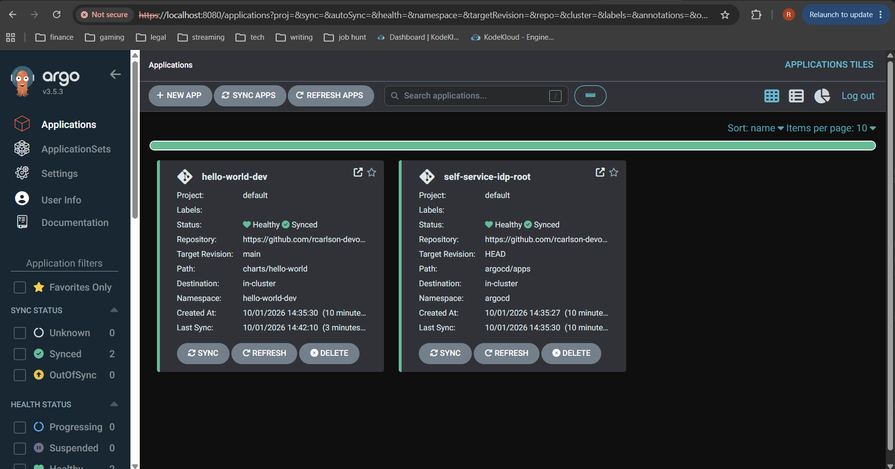
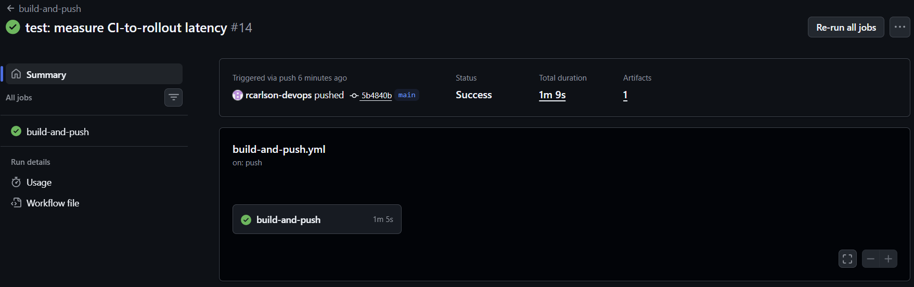
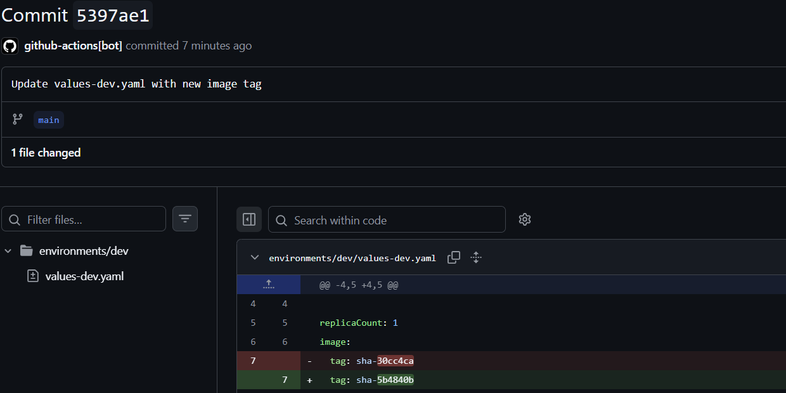

# Phase 1: Foundation

**Status:** Complete (2026-10-01)
**Exit criteria:** Push to Git, app deploys automatically with no manual `kubectl apply`. Met.

## What was built

- Local k3d cluster (1 server, 2 agents, k3s v1.35.5) created and configured by a single script, `bootstrap/bootstrap.sh`
- Argo CD v3.5.3 installed from a pinned Kustomize base, with the UI exposed declaratively
- App-of-apps pattern: `argocd/root.yaml` is the only manual `kubectl apply`; everything else is discovered from Git
- Go hello-world service with a Helm chart, built and pushed to private GHCR by GitHub Actions
- CI commits an immutable `sha-<short>` tag back to `environments/dev/values-dev.yaml`, so Git records what is deployed. CI never touches the cluster.

## The loop

1. Developer pushes code under `app/`
2. GitHub Actions runs `go vet` and `go test`, builds the image, and pushes `sha-<short>` to GHCR
3. The workflow commits the new tag to `environments/dev/values-dev.yaml`
4. Argo CD detects the Git change and rolls out the new image

## Metrics

| Metric | Value | Notes |
|---|---|---|
| Full rebuild (cluster delete to bootstrap complete) | 1 m 22 s | `time ./bootstrap/bootstrap.sh` |
| CI duration (commit to bot tag commit) | ~65 s | From git timestamps; upper bound |
| **Push to running pod, end to end** | **~1 m 45 s** | One measured run; default Argo polling (about 3 min interval), no webhook |

The end-to-end figure is a single sample. Argo's default poll interval means it will vary run to run.

## Evidence

**Argo CD showing the app Synced and Healthy**

**Successful GitHub Actions run**

**Bot commit writing the image tag back to Git**

## Problems hit and what they taught me

- **Hand-edited Service.** The Argo CD UI was only reachable because of a manual edit to the `argocd-server` Service. I found it through the `last-applied-configuration` annotation and moved it into the Kustomize patch, so a rebuilt cluster is reachable with no hand edits.
- **Reproducibility.** I proved the bootstrap by deleting the cluster and rebuilding from scratch: 1 m 22 s.
- **SSH vs HTTPS repo URL.** A deploy-key-dependent SSH URL meant a fresh clone could not bootstrap. I switched to HTTPS on a public repo so bootstrap needs no credentials.
- **Image tag default.** A never-published `dev-latest` default let a misconfiguration deploy silently. The chart now uses `required` for `image.tag`, so it fails at render time.
- **Server-side apply.** The ApplicationSet CRD is too large for client-side apply ("annotation too long"), so Argo CD is installed with server-side apply.

## Known gaps carried forward

- Argo pickup is poll-based; a webhook would cut and stabilize the delay but needs a public endpoint (not available on k3d)
- `ghcr-cred` pull secret is created from env vars by `bootstrap.sh`; replaced by External Secrets in Phase 4
- The Go app has no `/metrics` endpoint yet (needed for Phase 5)
- Chart `fullname` ignores the release name; must be fixed before the Phase 3 scaffolder generates multiple services
